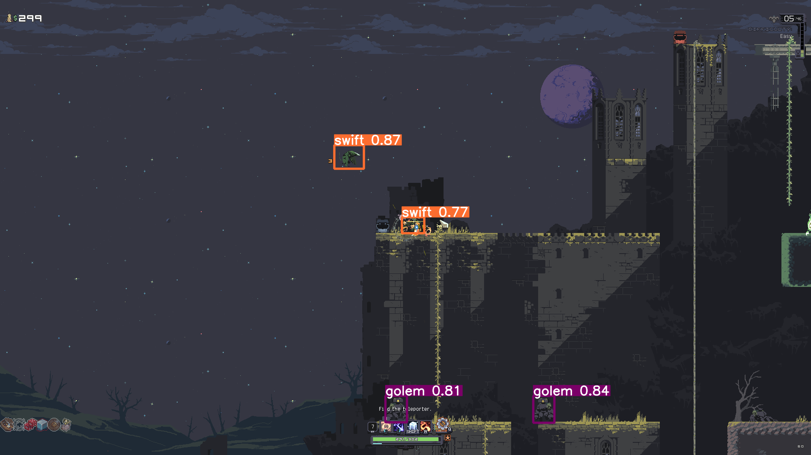

# Risk of Rain Returns Reinforcement Learning Agent

This repository contains a Reinforcement Learning (RL) agent designed to play Risk of Rain Returns. The agent utilizes a custom Gymnasium environment and leverages YOLOv5 for enemy classification within the game. 

## Features

- **Gymnasium Environment:** Provides a standardized interface for interacting with the Risk of Rain Returns game, allowing for seamless integration with various RL algorithms.
- **YOLOv5 Enemy Classification:** Employs YOLOv5 for real-time detection and classification of enemies within the game, providing valuable input to the RL agent.
- **Reinforcement Learning Agent:** Implements a customizable RL algorithm (e.g., DQN, PPO) to learn optimal actions based on game state and enemy information.
- **Modular Design:**  The components are designed to be modular, allowing for easy experimentation with different RL algorithms, reward functions, and action spaces.

## Example: Enemy Classification

The image shows an example of the YOLOv5 output, where enemies are detected and classified within the Risk of Rain Returns game scene. This information is then used as input to the RL agent for decision-making.

## Getting Started

1. **Dependencies:**
   - Install the required Python packages from `requirements.txt` using `pip install -r requirements.txt`.
2. **Game Setup:**
   - Ensure Risk of Rain Returns is installed and accessible through Steam.
   - Configure the game settings for compatibility with the environment (e.g., windowed mode, specific resolution).
3. **Environment Setup:**
   - Configure the environment parameters in `config.py` (e.g., game window size, action space, observation space).
4. **Training:**
   - Run the training script (e.g., `train.py`) to start the RL agent training process.
5. **Evaluation:**
   - Use the evaluation script (e.g., `evaluate.py`) to assess the performance of the trained agent.

## Project Structure